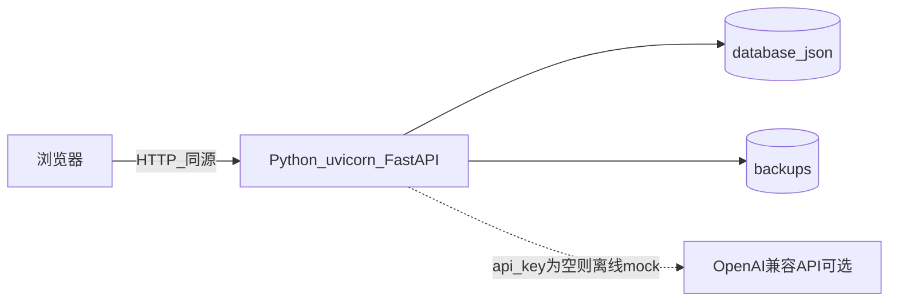

# SmarterPM 部署指南（面向产品经理 / 项目经理）

本文说明如何从一台「几乎没有配置过开发环境」的电脑或服务器开始，把 SmarterPM 跑起来并在浏览器里访问。假设你已拿到代码仓库地址（HTTPS 或 SSH），并具备基础的终端操作能力。

---

## 系统是怎样工作的（一页纸）

SmarterPM 用 **一个 Python 进程** 同时提供网页前端与接口：后端框架为 FastAPI，由 uvicorn 启动；浏览器访问的页面与 `/api/*` 接口在同一个端口上（同源）。业务数据保存在项目根目录的 **`database.json`**，每次写入前会自动备份到 **`backups/`** 目录。

可选能力：**大语言模型（LLM）** 通过 OpenAI 兼容接口调用；若在配置里 **不写 API Key**，系统会自动降级为离线演示模式，流程仍可走完。



---

## 1. 前置说明

| 项目 | 说明 |
|------|------|
| **目标** | 在本机、局域网服务器或云主机上启动服务，用浏览器访问界面 |
| **默认端口** | `11011`（见仓库根目录 `config.example.json`） |
| **默认监听地址** | `127.0.0.1` 表示 **只允许本机** 浏览器访问 |
| **局域网或外网访问** | 需把 `config.json` 里 `server.host` 改为 `0.0.0.0`，并在操作系统防火墙 / 云安全组中 **放行对应端口** |
| **敏感信息** | 不要把 `llm.api_key`、SSH **私钥** 发到聊天、邮件正文或截图里；公钥可以添加到 Git 或服务器 |

---

## 2. 生成 SSH 密钥（按需）

SSH 密钥常用于两件事（二选一即可，按你的场景做）：

1. **克隆私有 Git 仓库**（`git@github.com:...` 形式）
2. **登录 Linux 服务器**（把公钥写到服务器的授权列表）

### macOS / Linux

在终端执行：

```bash
ssh-keygen -t ed25519 -C "你的名字或邮箱"
```

一路回车可使用默认路径。完成后：

- **私钥（勿外传）**：`~/.ssh/id_ed25519`
- **公钥（可添加到 GitHub/GitLab 或服务器）**：`~/.ssh/id_ed25519.pub`

### Windows

推荐使用 **Windows Terminal**，内置 OpenSSH 时命令与 macOS 相同。安装 [Git for Windows](https://git-scm.com/download/win) 后也可通过「Git Bash」执行同样的 `ssh-keygen`。

**验收（克隆代码场景）**：例如 GitHub：

```bash
ssh -T git@github.com
```

看到成功提示或无「Permission denied」即可。**验收（登录服务器场景）**：

```bash
ssh 用户名@服务器IP或域名
```

---

## 3. 安装 Git 并获取代码

- **安装**：参阅官方文档 [Getting Started - Installing Git](https://git-scm.com/book/en/v2/Getting-Started-Installing-Git)。
- **克隆（SSH 示例）**：把下方地址换成你们团队的真实仓库地址。

```bash
git clone git@example.com:your-org/SmarterPM.git
cd SmarterPM
```

若团队提供的是 **HTTPS** 链接，则使用：

```bash
git clone https://example.com/your-org/SmarterPM.git
cd SmarterPM
```

**验收**：当前目录下能看到 `backend/`、`frontend/`、`config.example.json`。

---

## 4. 安装 Python

**推荐版本：Python 3.10 或以上。** 团队已在 3.11 上验证；安装时请从官网下载最新稳定版：[https://www.python.org/downloads/](https://www.python.org/downloads/)

### Windows

运行安装程序时勾选 **「Add Python to PATH」**。然后在「命令提示符」或 PowerShell 中执行：

```bat
py -3 --version
```

或：

```bat
python --version
```

### macOS

可从 python.org 安装官方包，或使用 Homebrew：`brew install python@3.11`。验收：

```bash
python3 --version
```

### Linux（Ubuntu / Debian 示例）

```bash
sudo apt update
sudo apt install -y python3 python3-venv python3-pip
python3 --version
```

其它发行版（如 Fedora）可使用 `dnf install python3 python3-pip` 等，包名可能略有差异。

**验收**：终端中能运行 `python3` 或 `python`，且主版本号 ≥ 3.10。

---

## 5. 虚拟环境与 Python 依赖

**在哪执行**：已进入项目根目录（与 `backend` 文件夹同级）。

项目的依赖列表在 **`requirements.txt`**（包含 FastAPI、uvicorn、pydantic、openai 等）。安装步骤：

### macOS / Linux

```bash
python3 -m venv .venv
source .venv/bin/activate
python -m pip install -U pip
pip install -r requirements.txt
```

### Windows（命令提示符）

```bat
py -3 -m venv .venv
.venv\Scripts\activate.bat
python -m pip install -U pip
pip install -r requirements.txt
```

**期望结果**：最后几行没有红色报错，`pip list` 中能看到 `fastapi`、`uvicorn`。

**常见失败**：网络超时 → 改用稳定网络或请 IT 配置镜像；Python 版本过低 → 升级到 3.10+。

---

## 6. 配置文件 `config.json`

若当前目录还没有 `config.json`，从示例复制一份：

### macOS / Linux

```bash
cp config.example.json config.json
```

### Windows

```bat
copy config.example.json config.json
```

用任意文本编辑器打开 `config.json`，PM 通常需要关心这些字段：

| 字段 | 含义 |
|------|------|
| `server.host` | 监听地址。`127.0.0.1` 仅本机；局域网访问常用 `0.0.0.0` |
| `server.port` | HTTP 端口，默认 `11011` |
| `llm.base_url` | 兼容 OpenAI 的 API 地址（如 DeepSeek、通义等厂商文档提供的 endpoint） |
| `llm.api_key` | API 密钥。**留空仍可演示**：系统自动使用离线 mock |
| `llm.model` | 模型名称，依厂商文档填写 |
| `llm.temperature` / `llm.timeout` | 采样温度与请求超时（秒） |
| `storage.database_file` | 业务数据库文件名，默认 `database.json` |
| `storage.backup_dir` / `storage.max_backups` | 自动备份目录与最多保留份数 |

---

## 7. 启动与关闭服务

### 7a. Windows：双击 BAT（适合不熟悉命令行的同事）

脚本位于 **项目根目录**（与 `config.json`、`backend` 同级）。

#### 启动：`start_smarterpm.bat`

1. 在资源管理器中进入项目根目录。
2. **双击** `start_smarterpm.bat`。

脚本会读取根目录 **`config.json`** 里的 `server.host`、`server.port`，决定在浏览器里打开的地址（没有配置文件时默认为 `127.0.0.1:11011`）。若 `host` 为 `0.0.0.0`，脚本仍会为本机浏览器打开 **`127.0.0.1`**（同一台电脑上访问）。

- 若存在 **`.venv\Scripts\python.exe`**，会用虚拟环境里的 Python 启动 `backend.main`。
- 若没有 `.venv`，会尝试系统自带的 `python`，可能失败——请先完成上一节的虚拟环境与 `pip install`。

会新开一个 **窗口标题为「SmarterPM」** 的黑色控制台窗口运行服务；约 2 秒后尝试用默认浏览器打开页面。

#### 关闭方式（任选其一）

1. **关掉** 标题为 **「SmarterPM」** 的那个控制台窗口。
2. 双击 **`stop_smarterpm.bat`**：脚本根据 `config.json` 里的 **`server.port`**（默认 `11011`）查找监听该端口的进程并强制结束。

#### 注意事项

- 请先完成 **虚拟环境创建** 与 **`pip install -r requirements.txt`**，否则启动容易失败。
- `stop_smarterpm.bat` 按 **端口** 结束进程：若该端口上跑了别的程序，有可能被一并结束——请保证配置的端口 **专用于 SmarterPM**。
- **局域网**：其它电脑访问时使用 `http://服务器IP:端口/`；BAT 自动打开的浏览器地址仍以本机 `127.0.0.1` 为准。

### 7b. 命令行启动（所有平台）

**在哪执行**：项目根目录，且已激活虚拟环境（macOS/Linux：`source .venv/bin/activate`；Windows：`.venv\Scripts\activate.bat`）。

```bash
python -m backend.main
```

前台运行时会占用当前终端；访问：`http://127.0.0.1:11011/`（若改了端口或 host，请相应替换）。

#### Linux / macOS：后台简易常驻（可选）

```bash
nohup python -m backend.main > smarterpm.log 2>&1 &
```

日志在 `smarterpm.log`，停止时可 `grep`/查找进程编号后结束该 Python 进程。

#### Linux：`systemd` 常驻示例（可选，需运维协助）

以下为最小示例，根据实际情况修改路径与用户：

```ini
[Unit]
Description=SmarterPM
After=network.target

[Service]
Type=simple
WorkingDirectory=/opt/SmarterPM
ExecStart=/opt/SmarterPM/.venv/bin/python -m backend.main
Restart=on-failure
User=www-data

[Install]
WantedBy=multi-user.target
```

保存后：`sudo systemctl daemon-reload && sudo systemctl enable --now smarterpm.service`（单元文件名自定）。

### 验收

- 浏览器能打开首页。
- （可选）访问健康检查：`http://127.0.0.1:11011/api/health`（端口按你的配置修改），应返回包含 `"ok": true` 的 JSON。

---

## 8. 运维要点（PM 可读）

- **备份**：复制项目根目录的 **`database.json`** 即可带走全部业务数据。
- **迁移到新机器**：在新机器放好代码与 `config.json`，把 **`database.json`** 放到项目根目录后启动。
- **升级代码**：在仓库目录执行 `git pull`，重新激活虚拟环境并执行 `pip install -r requirements.txt`，再重启进程。
- **生产环境建议**：SSH 管理、防火墙最小放行、HTTPS 反向代理（如 Nginx/Caddy）——具体配置交给运维处理更合适。

---

## 9. 常见问题（FAQ）

| 现象 | 可能原因与处理 |
|------|----------------|
| 浏览器打不开 | 服务未启动、端口错、防火墙拦截 |
| 局域网别的电脑访问不了 | `server.host` 仍是 `127.0.0.1`，应改为 `0.0.0.0` 并放行端口 |
| 提示找不到 `python` | Windows 未勾选 PATH；尝试 `py -3` 或 `python3` |
| `pip install` 失败 | 网络问题、Python 版本过低、`requirements.txt` 损坏 |
| Windows 双击 BAT 无效 | 先在同一目录用命令行完成 `.venv` 与 `pip install`；查看「SmarterPM」窗口内的报错 |
| 关不掉服务 | 关闭「SmarterPM」窗口或运行 `stop_smarterpm.bat`；仍占用则检查是否有其它程序占用配置的端口 |

---

## 参考链接

- 功能说明与快速命令：[README.md](README.md)
- 配置示例：[config.example.json](config.example.json)
